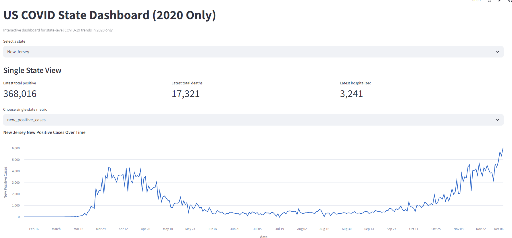
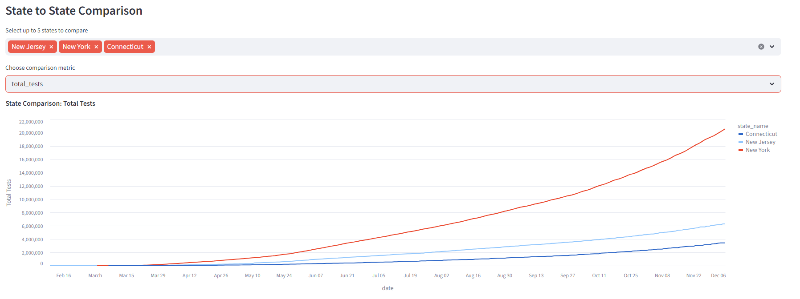

# US COVID State Dashboard (2020 Only)

Kaggle source: [US COVID-19 in USA](https://www.kaggle.com/datasets/sudalairajkumar/covid19-in-usa?select=us_states_covid19_daily.csv)

Dashboard Link: [View the website](https://2020unitedstatescovid19datavisualization-2ojqvkssbtj6eliqekcrd.streamlit.app/)

This project is a Python, SQL, and Streamlit analytics workflow built from historical U.S. state-level COVID-19 data for 2020 only. It cleans the raw CSV, stores the transformed data in SQLite, and provides an interactive dashboard for state-level trend analysis and multi-state comparison.

## Program Purpose

This project demonstrates the full lifecycle of a small analytics application, from raw data ingestion to cleaned storage and finally visual exploration.

## Dataset Focus

The original CSV contains 55 total columns, but this project focuses on the most useful state-level metrics:

- `date`
- `state`
- `positive`
- `negative`
- `totalTestResults`
- `hospitalizedCurrently`
- `death`
- `positiveIncrease`
- `negativeIncrease`
- `deathIncrease`

These are cleaned and renamed into:

- `date`
- `state_code`
- `state_name`
- `total_positive`
- `total_negative`
- `total_tests`
- `hospitalized_currently`
- `total_deaths`
- `new_positive_cases`
- `new_negative_tests`
- `new_deaths`

## Dashboard Preview

## Trends and Insights

The dashboard is designed to make the major 2020 patterns easier to explore across states and over time. The data shows strong variation in cumulative case counts, hospitalizations, and deaths between states, with California, Texas, Florida, New York, and Illinois among the states with the highest totals by the end of the year.

It also highlights how the pandemic changed across months. Reported new cases peaked in November 2020, while reported deaths peaked in April 2020, showing that the timing of case growth and mortality did not always move in the same direction.

The state comparison views help surface these differences quickly, making the project useful for both technical exploration and public health storytelling. By pairing cleaning, SQLite storage, and interactive visualization, the project shows how Python can support a complete analytics workflow rather than just static charting.
